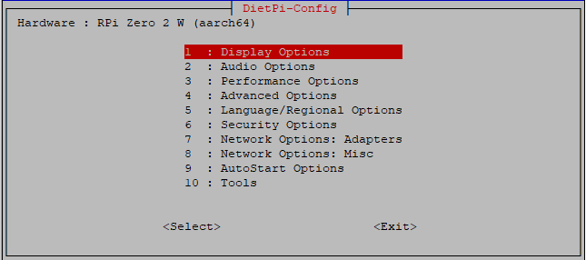
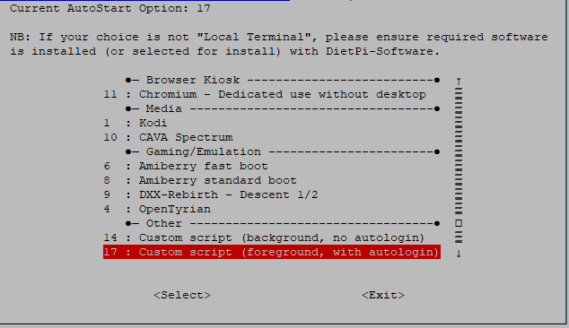

# ProxiTalk DietPi Setup Guide

This guide will walk you through setting up DietPi to run ProxiTalk on startup with all necessary dependencies for all apps.

## Table of Contents
1. [Initial DietPi Setup](#initial-dietpi-setup)
2. [System Dependencies](#system-dependencies)
3. [Python Dependencies](#python-dependencies)
4. [Audio Setup](#audio-setup)
5. [Piper TTS Setup](#piper-tts-setup)
6. [ProxiTalk Installation](#proxitalk-installation)
7. [Auto-start Configuration](#auto-start-configuration)
8. [Troubleshooting](#troubleshooting)
9. [Final Steps](#final-steps)

## Initial DietPi Setup

1. **Download and Flash DietPi**:
   - Download the latest DietPi image from [dietpi.com](https://dietpi.com/) make sure you pick the ARMv8 version made for the Raspberry Pi Zero 2W.
   - Flash to microSD card (32GB+ Recommended) using [Raspberry Pi Imager](https://www.raspberrypi.com/software/) or a similar tool.
   - Refer to the [DietPi Quick Start Guide](https://dietpi.com/docs/install/) for flashing instructions.

2. **First Boot Configuration**:
   - If you want to remote into your Pi and not have to use a monitor, you can enable SSH during the first boot setup (Recommended).
   - You can also set up Wi-Fi during this step if you are not using Ethernet (Recommended).
   - [This Tutorial](https://youtu.be/vlMpn9u0Y4o?t=125) will walk your through the whole process.

3. **Configure DietPi-Config**:
   ```bash
   sudo dietpi-config
   ```
   - Enable I2C in Advanced Options

## System Dependencies

Install / Update required system packages:

```bash
# Update package lists
sudo apt update

# Install Python and development tools
sudo apt install -y python3 python3-pip python3-dev python3-venv

# Install I2C tools and libraries
sudo apt install -y i2c-tools libi2c-dev

# Install audio libraries (May already be installed)
sudo apt install -y alsa-utils pulseaudio pulseaudio-utils

# Install multimedia libraries (only if you want for some apps)
sudo apt install -y ffmpeg

# Install font packages (May already be installed)
sudo apt install -y fonts-dejavu fonts-dejavu-core fonts-dejavu-extra

# Install networking tools
sudo apt install -y curl wget git
```

## Python Dependencies

Install Required Python packages:

```bash
# Upgrade pip
pip install --upgrade pip

# Install core dependencies
pip install pillow
pip install luma.oled
pip install pygame

# Install additional dependencies for online apps
pip install requests
```

## Audio Setup

Please Follow [Adafruit's Awesome Guide](https://learn.adafruit.com/adafruit-speaker-bonnet-for-raspberry-pi/raspberry-pi-usage) and fully install the Adafruit I2S 3W Stereo Speaker Bonnet.

## Piper TTS Setup

Install and configure Piper for text-to-speech:

```bash
# Create piper directory
mkdir -p /home/dietpi/piper

# Download Piper binary (ARM64 for Raspberry Pi 4, adjust for your architecture)
cd /home/dietpi/piper
wget https://github.com/rhasspy/piper/releases/latest/download/piper_linux_aarch64.tar.gz

# Extract Piper
tar -xzf piper_linux_aarch64.tar.gz
chmod +x piper

# Download a voice model (English GB - Cori Medium)
wget https://huggingface.co/rhasspy/piper-voices/resolve/v1.0.0/en/en_GB/cori/medium/en_GB-cori-medium.onnx
wget https://huggingface.co/rhasspy/piper-voices/resolve/v1.0.0/en/en_GB/cori/medium/en_GB-cori-medium.onnx.json

# Test Piper TTS
echo "Hello from ProxiTalk" | ./piper --model en_GB-cori-medium.onnx --output_file test.wav
aplay test.wav

# Create cache directory
mkdir -p /home/dietpi/piper_cache

# Clean up test file
rm test.wav
```

## ProxiTalk Installation

Clone and set up ProxiTalk:

```bash
# Navigate to home directory
cd /home/dietpi

# Clone ProxiTalk repository (replace with your repository URL)
git clone https://github.com/lcraver/ProxiTalk.git
cd ProxiTalk

# Make ProxiTalk executable
chmod +x proxitalk.py

# Test Boot ProxiTalk
sudo python3 /home/dietpi/ProxiTalk/proxitalk.py
```

## Auto-start Configuration

Configure ProxiTalk to start automatically on boot:

1. **Open DietPi-Config**:
   ```bash
   sudo dietpi-config
   ```

2. **Navigate to AutoStart Options**:
   
   
   
   - Select "AutoStart Options" from the main menu

3. **Configure Custom Autostart**:
   
   
   
   - Select "Custom" option
   - Add the following to the custom script:
   ```bash
   #!/bin/bash
   # DietPi-AutoStart custom script
   # Location: /var/lib/dietpi/dietpi-autostart/custom.sh

   sudo python3 /home/dietpi/ProxiTalk/proxitalk.py

   exit 0
   ```

4. **Save and Exit**:
   - Select "Ok" to save the configuration
   - Exit DietPi-Config

## Troubleshooting

### Common Issues and Solutions

1. **OLED Display Not Working**:
   ```bash
   # Check I2C connection
   sudo i2cdetect -y 1
   
   # Verify I2C is enabled
   lsmod | grep i2c
   
   # Check permissions
   ls -la /dev/i2c-*
   groups dietpi  # Should include 'i2c'
   ```

2. **Audio Not Working**:
   ```bash
   # Test audio
   speaker-test -c2 -t wav
   
   # Check audio devices
   aplay -l
   
   # Adjust volume
   alsamixer
   ```

3. **Piper TTS Not Working**:
   ```bash
   # Test Piper manually
   cd /home/dietpi/piper
   echo "test" | ./piper --model en_GB-cori-medium.onnx --output_file test.wav
   aplay test.wav
   
   # Check model path in config/paths.py
   ```

4. **ProxiTalk Won't Start**:
   ```bash
   # Check logs
   sudo journalctl -u proxitalk.service -f
   
   # Test manually
   source /home/dietpi/proxitalk-venv/bin/activate
   cd /home/dietpi/ProxiTalk
   python3 proxitalk.py
   ```

5. **Python Import Errors**:
   ```bash
   # Verify virtual environment
   source /home/dietpi/proxitalk-venv/bin/activate
   pip list
   
   # Reinstall problematic packages
   pip install --force-reinstall pillow luma.oled
   ```

6. **FFmpeg Not Found (Video Player)**:
   ```bash
   # Install FFmpeg
   sudo apt install -y ffmpeg
   
   # Verify installation
   ffmpeg -version
   ```

### Log Files

Monitor these log files for troubleshooting:

- **System logs**: `sudo journalctl -f`
- **ProxiTalk service**: `sudo journalctl -u proxitalk.service -f`
- **I2C debug**: `dmesg | grep i2c`
- **Audio debug**: `dmesg | grep audio`

## Final Steps

1. **Reboot the system** to ensure all configurations take effect:
   ```bash
   sudo reboot
   ```

2. **Verify ProxiTalk starts automatically** after boot

3. **Test all functionality**:
   - Display output
   - Audio playback
   - TTS functionality
   - Input handling
   - App launching

Your ProxiTalk system should now be ready to use on DietPi!