# ProxiTalk Assembly Guide

## Table of Contents

- [Introduction](#introduction)
- [Case](#case)
- [Software Part I](#software-part-i)
- [Raspberry Pi Hardware](#raspberry-pi-hardware)
- [Audio](#audio)
- [Screen, Keyboard, and Middle Plate](#screen-keyboard-and-middle-plate)
- [Software Part II](#software-part-ii)
- [Final Assembly](#final-assembly)
- [Appendix](#appendix)

## Introduction

This is the assembly guide for the v1 ProxiTalk designed by pidge.

The ProxiTalk is a prototype device. While this guide does its best to make things straightforward, please be aware that there will be times when you need to troubleshoot or problem-solve to move forward. If you keep an open attitude about it, you might learn a lot and have a lot of fun!

> [!NOTE] 
> This process involves soldering and using a linux computer from the command line. If those skills are new to you, you might want to check out [iFixit's Soldering 101](https://youtu.be/rK38rpUy568) and [How to use the Command Line](https://youtu.be/5XgBd6rjuDQ). Just remember: we all started somewhere!

Each section of this guide will walk you through a single step in the assembly. Do all the steps, and you should end up with a working ProxiTalk!

> [!IMPORTANT] 
> Sections marked **Important** will describe how to check your work before moving on.

## Case

In this section, you'll print the case for your ProxiTalk.

The ProxiTalk case is designed to be 3D printed using PLA filament. The [case files](https://github.com/lcraver/ProxiTalk/tree/main/wiki/case-files) are available in multiple formats to support different 3D printers and slicers:

| **File Name**                  | **Description**            | **Purpose**                                      |
|------------------------------ |-------------------------- |------------------------------------------------ |
| `ProxiTalk - Top.obj`          | Top faceplate              | Main top piece with display window               |
| `ProxiTalk - Top Color.obj`    | Top faceplate Accent Color | Optional colored accent piece                    |
| `ProxiTalk - Middle.obj`       | Middle frame section       | Houses screen and keyboard                       |
| `ProxiTalk - Bottom.obj`       | Bottom shell               | Contains the bulk of the device and access ports |
| `ProxiTalk - Power Switch.obj` | Power switch actuator      | Actuates the internal slide switch               |
| `ProxiTalk - Bambu [All].3mf`  | Complete Bambu project     | All parts pre-arranged for Bambu printers        |

If you have your own 3D printer, that's lovely! If not, you might need to find someone with a 3D printer or a makerspace where you can use one. There are also services that will print your files and ship them to you, but I've never used one and can't say whether they work well or not. You could also improvise or design a case from your own materials if you wanted! This guide is working under the assumption that you're printing this case though which does affect the order parts are assembled in.

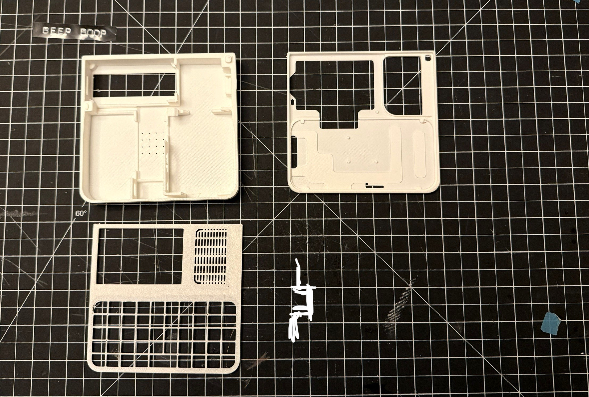

> [!IMPORTANT] 
> At this point, you should have 4 distinct pieces: The bottom plate, a middle plate, a face plate, and a cap for the power switch. Check to make sure that they all fit together.


## Software Part I

In this section, you will load DietPi onto the Rasbperry Pi and obtain shell access. That way, you can be sure the Pi itself works before you build everything else around it!

> [!TIP] 
> This section follows [How to install DietPi](https://dietpi.com/docs/install/) and [Headless install of Dietpi](https://youtu.be/vlMpn9u0Y4o). If you start to feel lost with these instructions, give one or both a try!


### Installing DietPi

-   Download a DietPi image from [dietpi.com](https://dietpi.com). Go with the ARMv8 version made for the Raspberry Pi Zero 2W.
-   Flash the image to your microSD card. If there's a tool you like to use for writing an OS to a SD card, use that. If you're not sure, you can use [Raspberry Pi Imager.](https://www.raspberrypi.com/software/)
-   Unless you have a way to connect your Raspberry Pi to ethernet, this would be a good time to set up the WiFi. I'd recommend following along with [Headless install of Dietpi](https://youtu.be/vlMpn9u0Y4o) if you start to feel overwhelmed in this part!
    -   In `dietpi.txt`, configure:
        -   `AUTO_SETUP_NET_WIFI_ENABLED=1` - *for DietPi to start with WiFi*
        -   `AUTO_SETUP_NET_STATIC_GATEWAY=` - *assign this to the address of your router if your router is your gateway. If it isn't, you know more than me. Just do your thing, you silly homelabber :b*
        -   `AUTO_SETUP_NET_USESTATIC=1` - *for DietPi to use a static IP which just makes it a little easier to find when we SSH in. You can let it take a dynamic IP if you want though!*
        -   `AUTO_SETUP_NET_STATIC_IP=` *Give DietPI a static IP to use on your network*
    -   In `dietpi-wifi`, configure:
        -   `aWIFI_SSID[0]=` your wifi SSID
        -   `aWIFI_KEY[0]=` your wifi password
-   Insert the SD card into the Raspberry Pi and power the Pi on by connecting one of the Raspberry Pi's MicroUSB ports to power. DietPi may take a few minutes to configure itself the first time it boots.

> [!IMPORTANT] 
> The Raspberry Pi has a green LED that should come on when it is powered. It may blink irregularly while the Pi is processing something. If it blinks with a regular pattern, you can look up the pattern in the [Raspberry Pi blink codes](https://github.com/raspberrypi/documentation/blob/develop/documentation/asciidoc/computers/configuration/led_blink_warnings.adoc) to see what the Pi is trying to tell you.


### Getting Shell Access

You'll need to be able to log in on the Raspberry Pi to set up the ProxiTalk software. This guide is going to use SSH, but you could connect a keyboard and monitor directly if you wanted!

-   Open your computer's terminal program and run the command `ssh root@x.x.x.x` where `x.x.x.x` is the IP address you assigned to your Raspberry Pi, e.g. `ssh root@192.168.0.50`
-   When prompted for a password, use `dietpi`
-   DietPi may prompt you through some first-time-setup steps like updating the root and user passwords. Work through those and close out of any TUI (Text UI) you land in. You should be able to reach a shell prompt:


-   While you're here, go ahead and enable **I2C** (it's just a protocol the Pi will use to communicate with some of the peripherals you connect):
    -   Run `sudo dietpi-config`
    -   Open Advanced Options and enable I2C

> [!IMPORTANT] 
> Power off the Rasbperry Pi, power it back on, and SSH back in, this time with the user `dietpi@x.x.x.x` and the password you set.


## Raspberry Pi Hardware

In this section, you'll add the heatsink and female pin headers to the Raspberry Pi itself.

### Pin headers

You will be using the Rasberry Pi GPIO (general purpose input/output) pins to power and control most of the peripherals. You can solder your connections directly onto the board if you want, but the case was designed to accomodate and use a female pin header block.

-   Solder the female pin headers to the Rasbperry Pi board. If you want to see someone else do it first, watch [How to solder header pins to the Raspberry Pi Zero (W)](https://youtu.be/UDdbaMk39tM)

> [!TIP] 
> It's okay if the first soldering job of your life isn't perfect! Remember that you can always de-solder something if you make a mistake. In my experience it's pretty hard to permanently damage the PCB itself. Just make sure that all your pins have a reliable contact to the PCB and that there aren't any shorts.

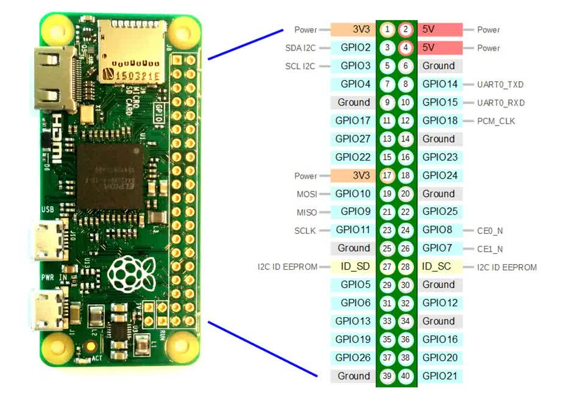
*This is the pinout diagram for your Raspberry Pi Zero. You'll reference it often!*

> [!TIP]
> After you solder on the header pins, it might be helpful to mark Pin 1 somehow. It can be difficult to match pins to the diagram after you've flipped and rotated the Raspberry Pi.

### Heatsink

-   Follow the directions the heatsink came with to attach it to your Raspberry Pi

> [!IMPORTANT] 
> Power the Rasbperry Pi back on and SSH in to reassure yourself that you didn't completely toast it while you were soldering on it. Also check to make sure that it fits in the case with the new attachments. The heatsink should line up with the square hole in the back and the SD card should line up with the slot in the side.


## Power

In this section, you will connect the battery and use it to power the Raspberry Pi.

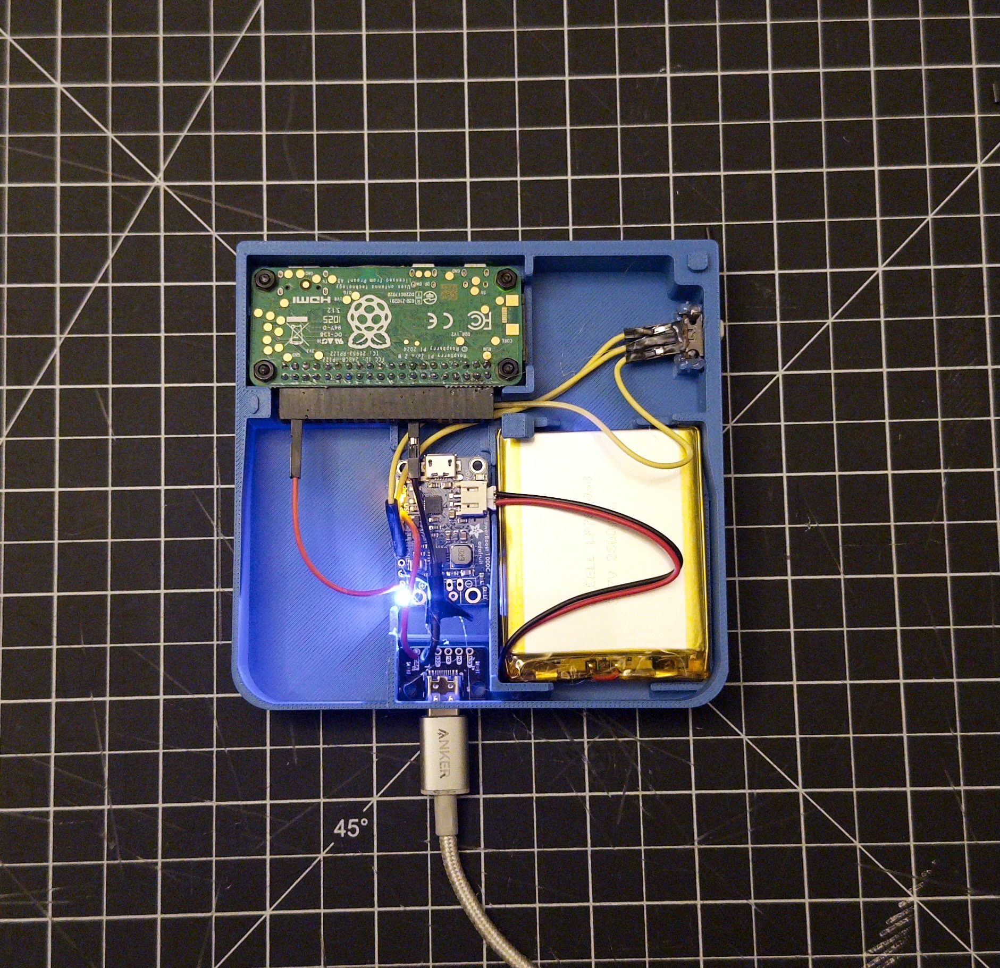

> [!WARNING] 
> Lithium-ion batteries can catch fire or have other violent chemical reactions if damaged. The one from the shopping list is pretty sturdy, but do not fold, crack, or puncture it.

> [!TIP] 
> You're going to start making wire connections now! You'll make your life easier if you can get the wires to be a good length. Too long and you'll have a hard time fitting all the slack into the case. Too short and you'll risk straining the wires and breaking them when you put it all together. Try laying all the components in the case first and do a dry run fitting it all together.

> [!TIP] 
> pidge soldered male headers onto their PCBs and made their own right-angle-female jumpers to connect wires them. lilian soldered their wires directly onto the PCBs which saved some effort up front, but was a big headache when a lead broke off after everything was already glued down. It's your ProxiTalk, and you get to decide how you want to go about assembling it!

To connect the battery, you'll make the following connections:

-   **USB-C Breakout Board** `GND` -> *both* **PowerBoost 1000C** `G` *and* **Raspberry Pi** `Ground` (there's several options, the picture uses `Pin 25`). I soldered a T-junction but do whatever works best for you!
    
   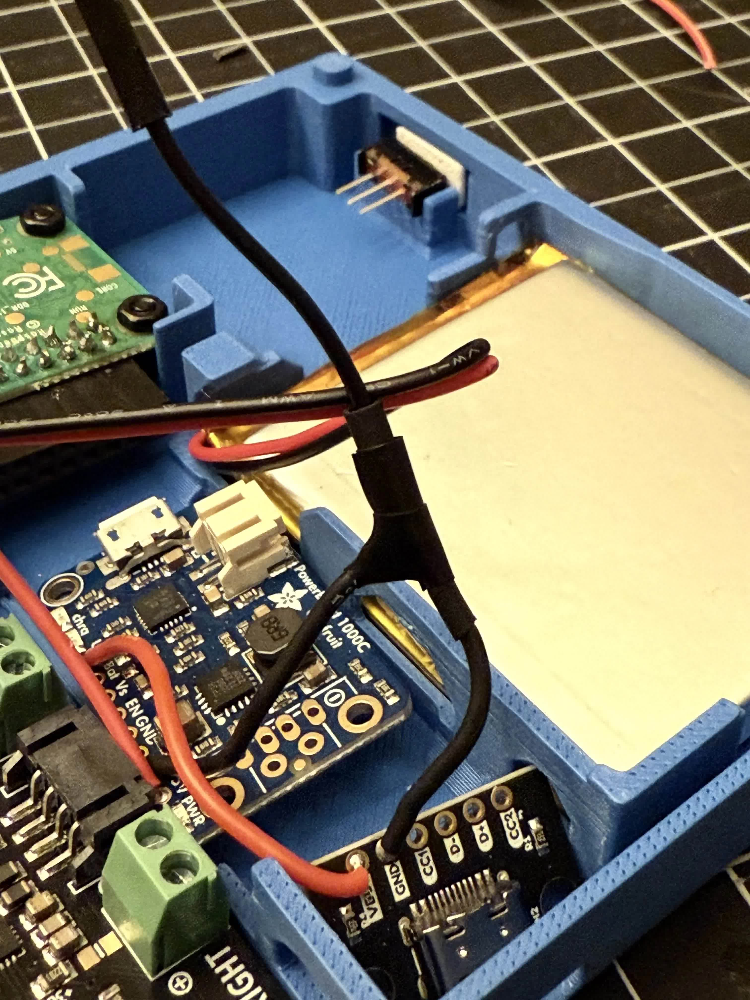
   
-   **USB-C Breakout Board** `VBUS` -> **PowerBoost 1000C** `5Vo`. This supplies 5V from the USB-C port which is used to charge the battery.
-   **PowerBoost 1000C** `5V` -> **Raspberry Pi** `5v` (there's several options, the picture uses `Pin 4`). The **PowerBoost 1000C** board is specifically designed to supply a steady 5.2V from this pin off the battery in a way that is useful for powering 5V boards like the Raspberry Pi!
-   **Power Switch** (all 3 pins) -> **PowerBoost 1000C** `GND`, `EN`, and `Vsh`. The switch is symmetrical so it doesn't really matter how you orient it. Just make sure that the middle pin on the switch connects to `EN` and the outer pins go to `GND` and `Vsh`. This tells the **PowerBoost 1000C** to turn its 5V output on or off according to the switch.
-   **Battery** -> **PowerBoost 1000C**. Just plug the cord coming out of the battery into the socket.

> [!IMPORTANT] 
> The **PowerBoost 1000C** has two indicator LEDs. A blue one comes on when it's supplying 5V power. An amber one comes on when it's charging the battery off the USB power which turns green when the battery is fully charged. Check that the blue one comes on and off when you toggle the switch and that the amber/green one comes on and off when you connect or disconnect the USB power.

> [!IMPORTANT] 
> At this point, the Raspberry Pi should turn on when you turn the power switch on. Check that you can connect to the Raspberry Pi by SSH while it's powered by the battery.


## Audio

In this section, you'll connect the speaker and use it to play sounds from the Raspberry Pi.


### Hardware

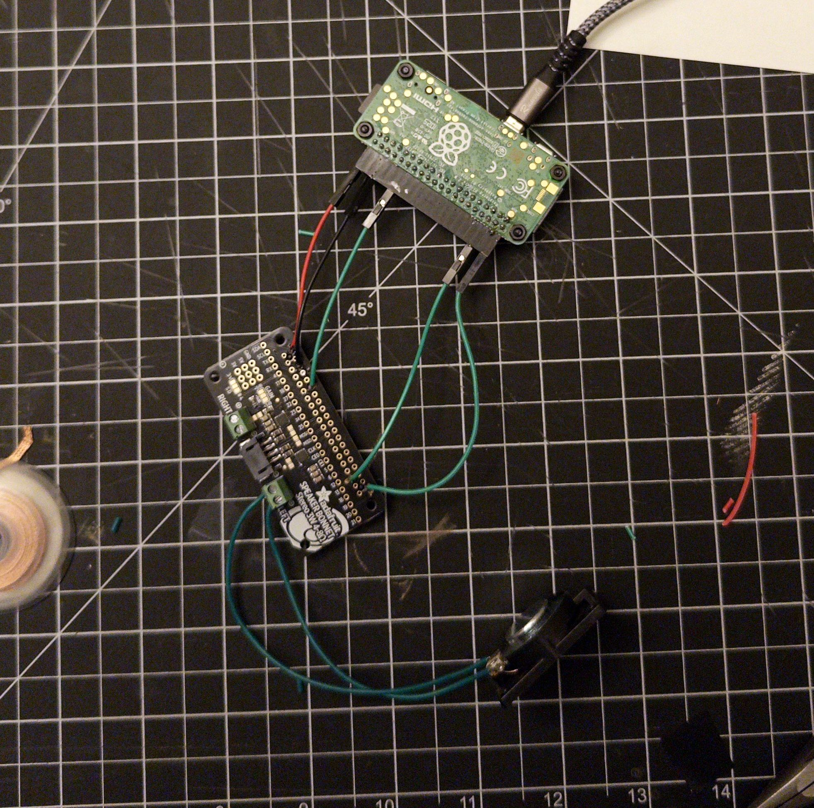

You'll connect the speaker to the Raspberry Pi through the **Adafruit Speaker Bonnet**. The speaker bonnet PCB has a grid of connectors that corresponds directly to the GPIO pins on the Raspberry Pi, if you can imagine it sitting directly on top of the Rasbperry Pi (like a bonnet)! The ProxiTalk case installs the bonnet next to rather than on top of the Raspberry Pi, so you'll make the connections you need piecemeal rather than soldering the whole grid at once.

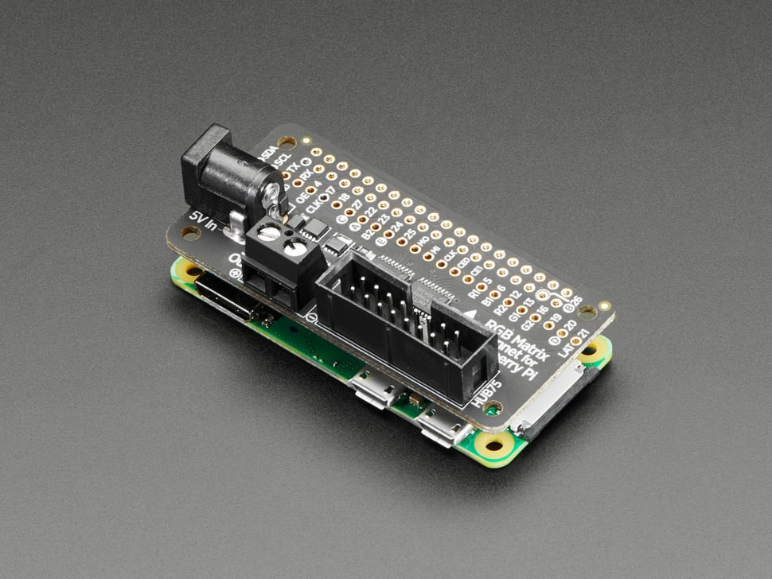
*This is an example of a similar "bonnet" PCB attached to a Raspberry Pi Zero. Note how each pin on the bonnet corresponds directly to a pin on the Raspberry Pi.*

To get your bearings, locate the pin on the **Adafruit Speaker Bonnet**'s GPIO connectors that corresponds to the Raspberry Pi's `Pin 2` (if the pi were wearing the bonnet as a hat!) and notice how you can trace an impression in the PCB from it to 3 connectors labeled `5V`. On the Raspberry Pi, `Pin 2` connects directly to the Pi's 5V circuit. Hence if you connect the Raspberry Pi's `Pin 2` to the corresponding pin on the speaker bonnet, you'll be supplying the bonnet with 5V power as it expects.

To connect the speaker to the Rasbberry Pi through the speaker bonnet, you'll make the following connections:

-   **Raspberry Pi** `Ground` -> **Adafruit Speaker Bonnet** corresponding pin. In the photo this is the black wire from Raspberry Pi `Pin 6` to the bonnet.
-   **Raspberry Pi** `Pin 12` (labelled `GPIO 18` in the pinout diagram - it's a nuisance) -> **Adafruit Speaker Bonnet** corresponding pin.
-   **Raspberry Pi** `Pin 35` (labelled `GPIO 19` in the pinout diagram) -> **Adafruit Speaker Bonnet** corresponding pin.
-   **Raspberry Pi** `Pin 40` (labelled `GPIO 21` in the pinout diagram) -> **Adafruit Speaker Bonnet** corresponding pin. These three are in green in the picture above and are how the Raspberry Pi transmits audio data to the board.
-   **Raspberry Pi** `5V` -> **Adafruit Speaker Bonnet** corresponding pin. In the photo above, this is the red wire connecting `Pin 2` to the bonnet. It uses 5V to power the speakers.
-   **Raspberry Pi `3V3` -> \*Adafruit Speaker Bonnet** corresponding pin. In the photo above, this is blue wire connecting `Pin 1` to the bonnet. The bonnet uses 3.3V for some of its logic circuits.
-   **Adafruit Speaker Bonnet** speaker `+` and `-` terminals to **Speaker** `+` and `-` terminals. Loosen the screws on the bonnet's speaker terminals, thread the wire in, and then tighten the screws to clamp it in. The bonnet should grip the wire enough that it won't come out if you try to gently move it. It doesn't matter if you use the header for the left or the right speaker, but don't mix-and-match. Solder the ends of each wire to their corresponding terminals on the speaker itself.


### Audio Software

Next, DietPi needs to be configured to use the GPIO pins as its audio output.

-   SSH into the Rasbperry Pi using the command `SSH dietpi@x.x.x.x` where `x.x.x.x` is the IP address of the Raspberry Pi on your network and log in using the password you set previously.
-   Follow the setup instructions in [Adafruit Speaker Bonnet for Raspberry Pi - Raspberry Pi Setup](https://learn.adafruit.com/adafruit-speaker-bonnet-for-raspberry-pi/raspberry-pi-usage). Here's some things to keep in mind as you go along:
    -   You do need to set up a virtual environment. The article [Python Virtual Environment Usage on Raspberry Pi](https://learn.adafruit.com/python-virtual-environment-usage-on-raspberry-pi/overview) gives a pretty good overview for the why and how. You'll be using this virtual environment to install some package dependencies for the ProxiTalk software later, so make sure that you're comfortable activating and deactivating the virtual environment you create during this step.
    -   You do want to activate the `/dev/zero/` background playback to get rid of popping sounds.
    -   You'll probably find that the installer script doesn't quite get everything working, or at least pidge and lilian did. Both of them had to plunge into the manual configuration instructions, and neither of them took great notes about how they got things working (sorry about that)! I'd recommend running the installer script, rebooting, running the script again, rebooting, and if that doesn't work, giving the manual instructions a try. My best guess is that it's the very last part, adding `dtoverlay=max98357a` to `/boot/firmware/config.txt` that does the job.
    -   You'll know things are working if, after rebooting and running the speaker setup script, it prompts you to test the speakers.
    -   If you do take better notes for this step, send them along so we can update the guide! I'm really sorry about that.

> [!IMPORTANT] 
> At this point, you should be able to get sound out of the speaker when you run `speaker-test -c 2`.


## Screen,  Keyboard, and Middle Plate

In this section, you'll connect the screen and keyboard to the Raspberry Pi. Their wires get routed through the middle plate of the case which covers all the bottom components, so it's easiest if you do it all in one go.

### Preparing wires for the screen and keyboard

First, you'll do your last bit of soldering on the bottom components while they're still out of the case.


> [!TIP] 
> Give yourself a lot of extra length on these wires when you first cut them. It'll make it a lot easier to route them through the middle plate, and then you can trim them to a precise length when you're ready to solder them to the peripheral components.

Solder the following connections:

-   **Raspberry Pi** `Pin 3` (labelled `SDA` on pinout diagram) -> **Adafruit Speaker Bonnet** corresponding pin
-   **Raspberry Pi** `Pin 5` (labelled `SCL` on pinout diagram) -> **Adafruit Speaker Bonnet** corresponding pin
-   **Adafruit Speaker Bonnet** `SDA` pin -> long wire ready to be connected later
-   **Adafruit Speaker Bonnet** `SCL` pin -> long wire ready to be connected later. These 4 are done in white in the picture but you'll want a way to distinguish the two wires when it's time to connect them to the screen.
-   **Adafruit Speaker Bonnet** `GND` headers -> long wire (2x) ready to be connected later (black in the picture)
-   **Adafruit Speaker Bonnet** `3V` headers -> long wire (2x) ready to be connected later (blue in the picture)

### Arranging the bottom of the case

Next, you'll seat all the components in the ProxiTalk case bottom:


Once you have the middle plate on and the screen and keyboard connected, it will be very cumbersome to work on anything in the bottom of the case, so take your time to get things how you like them. Once you're feeling good about your work, you can secure any particularly loose bits with hot glue. **DO NOT** glue the battery down. It should fit very snug in the case without glue.

> [!TIP] 
> You can go very light on the hot glue. It holds to the PLA *very* well and keeping it light makes your life easier if you need to take things apart later!

Next, you'll enclose the bottom with the ProxiTalk's middle plate. Route your loose wires through the holes for the screen and the keyboard. The screen needs a `GND`, a `3V`, and the `SDA` and `SCL` connections. The keyboard needs a `GND` and a `3V`.

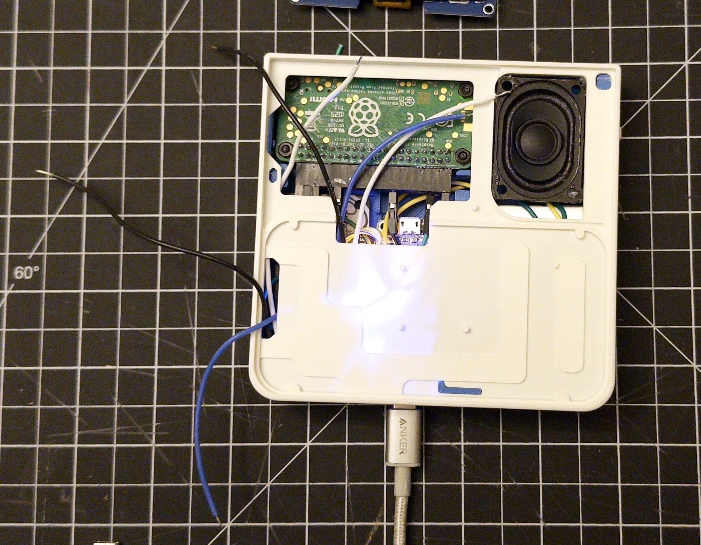

### Wiring the screen

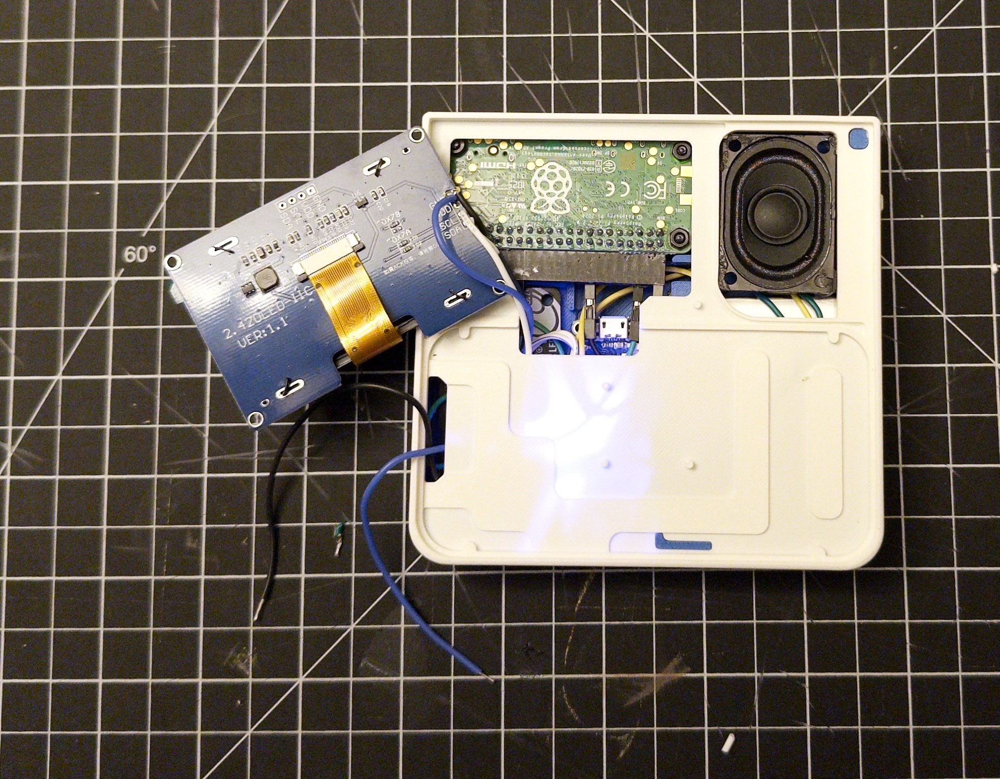

To connect the screen, tim the wires to length so you don't have too much slack and then solder the following connections::

-   **Adafruit Speaker Bonnet** `GND` -> **Screen** `GND`
-   **Adafruit Speaker Bonnet** `SDA` -> **Screen** `SDA`
-   **Adafruit Speaker Bonnet** `SCL` -> **Screen** `SCL`
-   **Adafruit Speaker Bonnet** `3V` -> **Screen** `VDD`. According to the screen spec sheet, it can take 3-5V. The 3V worked fine for me!
    
    Make sure your wire routing allows you to seat the screen in the middle plate properly. Crossed or bunched wires can stack on the Raspberry Pi. The screen will stand off from the plate a little bit because of the pins that secure the screen itself to the PCB, but it shouldn't have any single high point that causes it to see-saw.
    
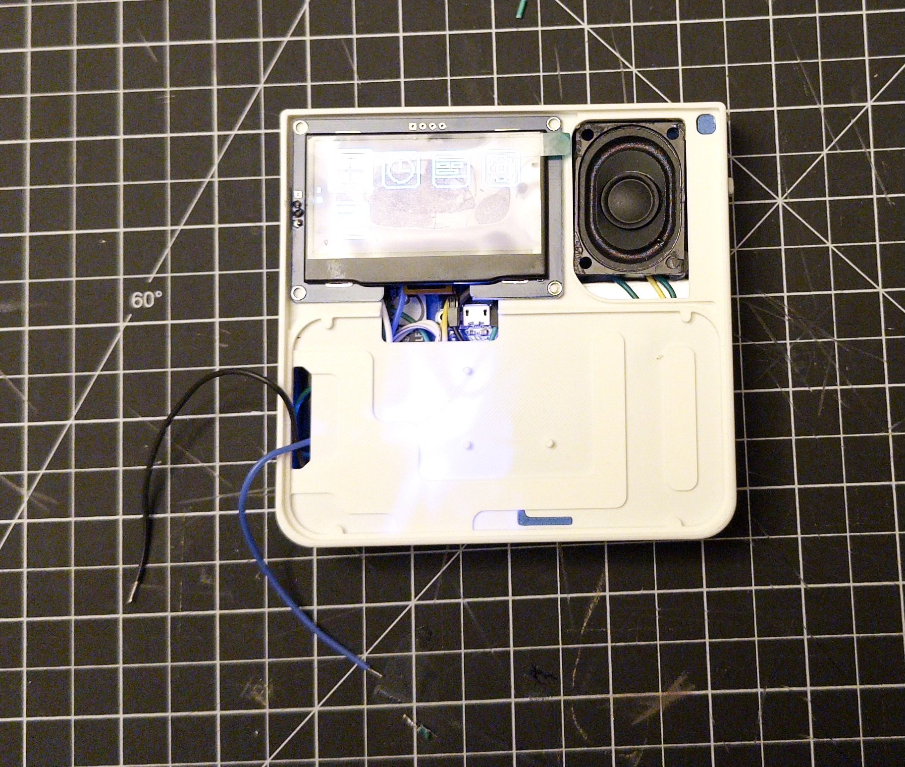

### Wiring the keyboard

To wire the keyboard, you'll first need to get it out of that bulky case!

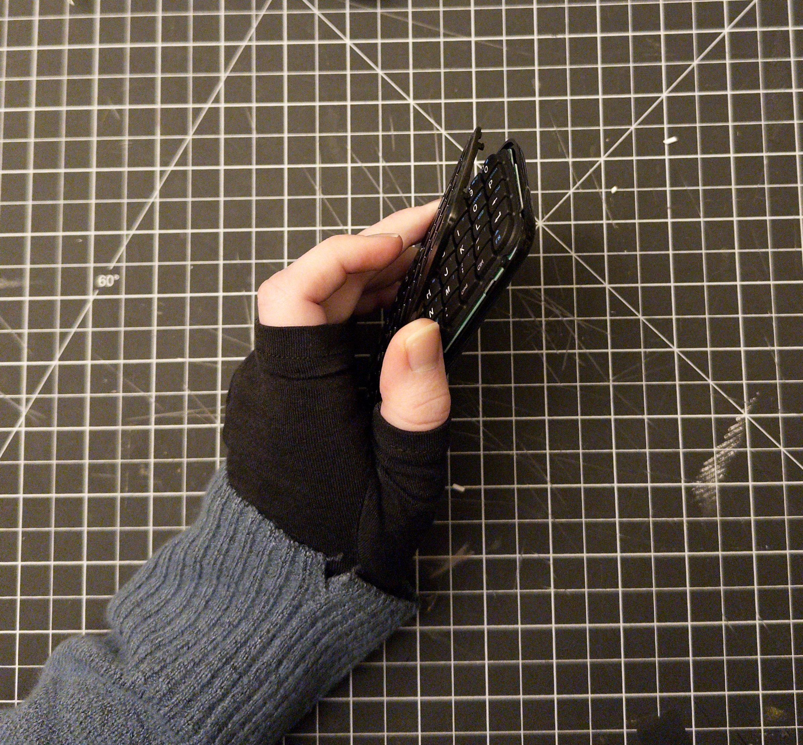
*Break it so you can make something better!*

-   Use something flat that is easy to control with good leverage to pry apart the case. Wedge your tool into the seam on the side and pry - it should pop open pretty easily. Just don't gouge yourself by mistake!

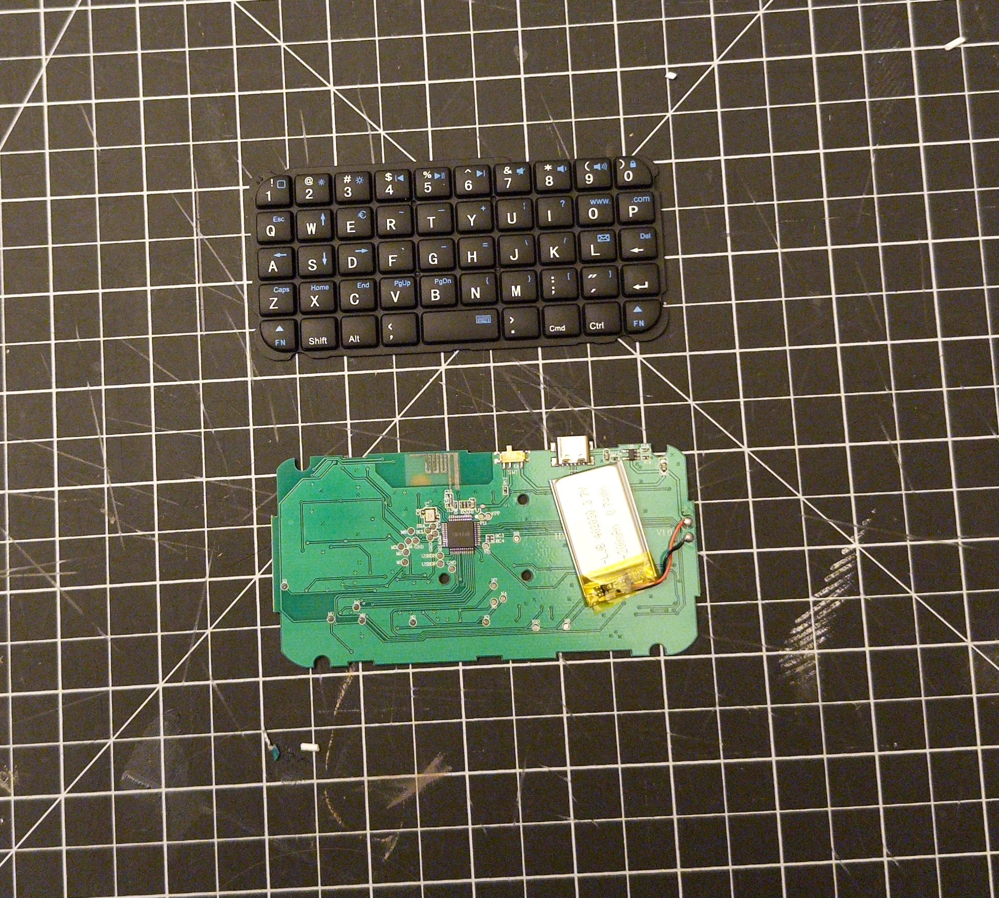
*You need the keyboard PCB and membrane keys.*

-   On the keyboard PCB mark which terminal has the red wire (this is the 3V supply from the battery) and which has the black wire (this is the ground).
-   Desolder these connections and safely dispose of the battery. The keyboard will be powered by the ProxiTalk's power supply instead.
    
  > [!WARNING] 
  > Some solders contain lead. Lead is toxic and there is no level of exposure that is known to be safe. When working with solder, especially unknown solder, protect yourself and others from fumes, ingestion, and skin exposure.
    
  Solder the following connections:
    
  -   **Adafruit Speaker Bonnet** `GND` -> **Keyboard PCB** `GND`
  -   **Adafruit Speaker Bonnet** `3V` -> **Keyboard PCB** `3V`

These two connections only supply power to the PCB. Data will be connected over Bluetooth.

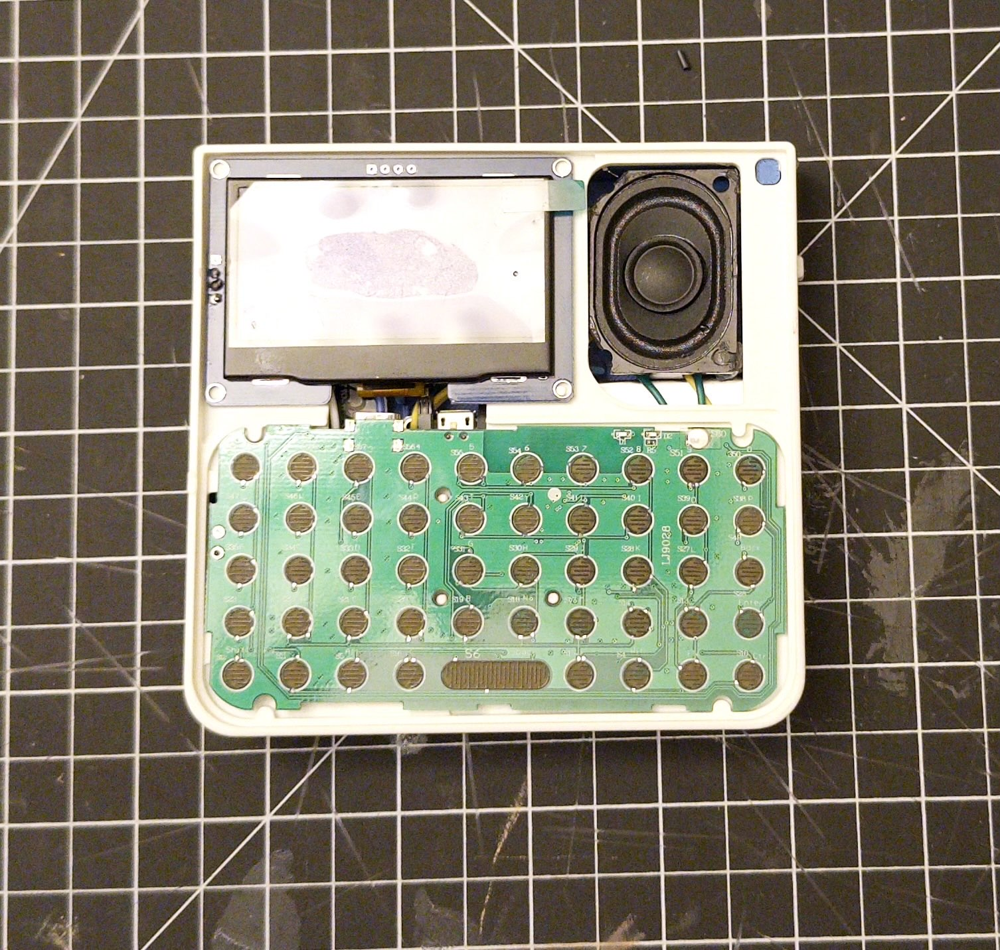

> [!IMPORTANT] 
> As with the screen, make sure that the PCB lies as flat as you can get it in the case. The middle plate is very thin and piled on a bunch of unruly wires so it's hard to completely eliminate bulging, but see what you can do to manage the worst of it. Verify that the top cover of the case fits over everything with the keyboard membrane in place.

> [!IMPORTANT] 
> Use the switch to turn the power on. The keyboard PCB should have a blue light that comes on (you might have to flip the small switch on the very top). There's also a small circular silver button on the top right of the keyboard - pressing and holding it should make the blue light blink as the keyboard goes into pairing mode.

> [!IMPORTANT] 
> With everything powered on, verify that you can still SSH in and confirm that `speaker-test -c 2` still plays sound. If you broke a wire at some point, it'll be better to know than after you glued it all up!

> [!IMPORTANT] 
> I couldn't think of any way to test the functionality of the screen and keyboard in a way that would be any less complicated than just configuring and booting the whole ProxiTalk itself. If you think of anything, let me know!

## Software Part II

In this section, you'll install the ProxiTalk software and configure it to start automatically when the Raspberry Pi boots up.

> [!TIP] 
> [ Integration Hell](https://www.urbandictionary.com/define.php?term=Integration+Hell) happens when it's time to connect a bunch of disparate systems into a unified whole and things just don't seem to work. Don't feel bad if it happens to you! Google your errors, test your assumptions, and try to isolate one part of the broken system at a time. If you start to feel frustrated or overwhelmed, come back to it another day. You'll do more harm than good if you try to force things along.

### ProxiTalk Dependencies

First, you'll install and update everything the ProxiTalk needs to run.

Some of these things might have already happened during the speaker setup, but go through them all just to be sure:

```bash
# Update package lists
sudo apt update

# Install Python and development tools
sudo apt install -y python3 python3-pip python3-dev python3-venv

# Install I2C tools and libraries
sudo apt install -y i2c-tools libi2c-dev

# Install audio libraries (May already be installed)
sudo apt install -y alsa-utils pulseaudio pulseaudio-utils

# Install multimedia libraries (only if you want for some apps)
sudo apt install -y ffmpeg

# Install font packages (May already be installed)
sudo apt install -y fonts-dejavu fonts-dejavu-core fonts-dejavu-extra

# Install networking tools
sudo apt install -y curl wget git
```

Next, activate the Python virtual environment you made during the speaker setup. Run these commands with the virtual envrionment active:

```bash
# Upgrade pip
pip install --upgrade pip

# Install core dependencies
pip install pillow
pip install luma.oled
pip install pygame

# Install additional dependencies for online apps
pip install requests
```

And then install Piper TTS:

```bash
# Create piper directory
mkdir -p /home/dietpi/piper

# Download Piper binary (ARM64 for Raspberry Pi 4, adjust for your architecture)
cd /home/dietpi/piper
wget https://github.com/rhasspy/piper/releases/latest/download/piper_linux_aarch64.tar.gz

# Extract Piper
tar -xzf piper_linux_aarch64.tar.gz
chmod +x piper

# Download a voice model (English GB - Cori Medium)
wget https://huggingface.co/rhasspy/piper-voices/resolve/v1.0.0/en/en_GB/cori/medium/en_GB-cori-medium.onnx
wget https://huggingface.co/rhasspy/piper-voices/resolve/v1.0.0/en/en_GB/cori/medium/en_GB-cori-medium.onnx.json

# Test Piper TTS
echo "Hello from ProxiTalk" | ./piper --model en_GB-cori-medium.onnx --output_file test.wav
aplay test.wav

# Create cache directory
mkdir -p /home/dietpi/piper_cache

```

> [!IMPORTANT] 
> At this point, you should be able to execute the command `aplay /path/to/test.wav` where `/path/to/test/` is the path to your test file, e.g. `aplay /home/dietpi/piper/test.wav` and hear a voice come out of the speaker.

### ProxiTalk software

Now it's time to install the actual proxitalk software! Make sure that you *still* have your Python virtual environment active for the final command!

```bash
# Navigate to home directory
cd /home/dietpi

# Clone ProxiTalk repository (replace with your repository URL)
git clone https://github.com/lcraver/ProxiTalk.git
cd ProxiTalk

# Make ProxiTalk executable
chmod +x proxitalk.py

# Test Boot ProxiTalk
sudo python3 /home/dietpi/ProxiTalk/proxitalk.py
```

> [!TIP] 
> If `proxitalk.py` complains that it's missing a file like a font or an icon, see if you can find that file in the `assets` folder, e.g. `/home/dietpi/ProxiTalk/assets/` and move it to where `proxitalk.py` wanted it to be.

> [!IMPORTANT] 
> You should be able to run the command `sudo python3 /home/dietpi/ProxiTalk/proxitalk.py` and start the ProxiTalk now. It will play a bootup sound and there will be icons on the screen. After the initial bootup chatter, it should post to the terminal occasionally that it doesn't detect a keyboard.

### Keyboard bluetooth

-   Exit the ProxiTalk script to get back to your shell prompt.
-   Run the command `bluetoothctl`. Your prompt should change to be `[bluetooth]#`.
-   enter the command `scan on`. It will start updating a feed with MAC addresses for bluetooth devices coming and going.
-   Put the keyboard into pairing mode. It should pop up somewhere in that sea of other devices coming and going. Don't worry, you don't have to try to catch it in all of that!
-   Run the command `devices` to see a list of devices the Raspberry Pi has seen since you started scanning. You can also run `scan off` if things are too noisy.
-   One of the devices in the list should be something like `XX:XX:XX:XX:XX:XX Bluetooth Keyboard`
-   Enter `pair XX:XX:XX:XX:XX:XX`, inserting the actual MAC address that was listed. You can save some tedious typing by typing `pair XX:` and hitting `TAB`. Just make sure it autofilled the right address!
-   Enter `trust XX:XX:XX:XX:XX:XX` to allow the keyboard to connect automatically in the future
-   Enter `connect XX:XX:XX:XX:XX:XX` to connect the keyboard
-   Enter `exit` to close `bluetoothctl`

> [!IMPORTANT] 
> Power off the ProxiTalk. Power it back on. SSH in. Activate the python virtual envrionment. Run `sudo python3 /home/dietpi/ProxiTalk/proxitalk.py`. This time around the startup sound should play, and there should be icons you can navigate around using the W, A, S, D keys. See if you can get into the app `proxi` for talking and say something! You're almost done!

> [!TIP] 
> The keyboard can get a little bit sleepy and sometimes takes a few button presses to wake up and start sending inputs to the Raspberry Pi.

### Autostart Configuration

-   Open the DietPi-Config TUI by executing `sudo dietpi-config` from the shell prompt
-   Select `AutoStart Options` from this menu
-   Scroll all the way down and select `Custom script (foreground, with autologin)`
-   Select `Custom`
-   Make this your custom script, where `/home/dietpi/venv/` is the path to the Python virtual environment you've been using:
    
    ```bash
     #!/bin/bash
    # DietPi-AutoStart custom script
    # Location: /var/lib/dietpi/dietpi-autostart/custom.sh
    
    sudo /home/dietpi/venv/bin/python /home/dietpi/ProxiTalk/proxitalk.py
    exit 0
    ```
    
Now when you turn off and turn on the ProxiTalk, DietPi should automatically log itself in and execute `proxitalk.py` using your virtual envrionment.

> [!TIP] 
> The Raspberry Pi can take a minute or two to boot up and fire up the ProxiTalk script. As long as the Raspberry Pi is powering on, give it a little bit of time before you assume something is wrong.

> [!IMPORTANT] 
> At this point, the ProxiTalk should start up a little bit after you power the Raspberry Pi on (it can sometimes take a minute or two to start). You should see icons on the display and you should be able to navigate around the menu using the W, A, S, and D keys on the keyboard.

## Final Assembly

In this section, you'll close up the finished ProxiTalk!

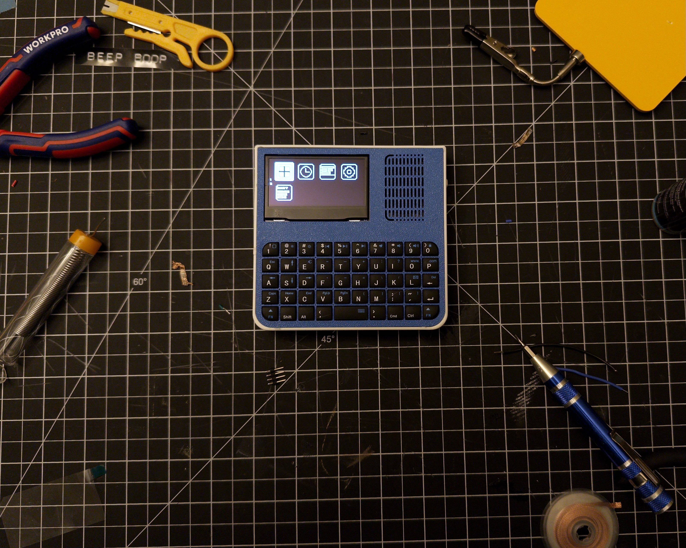

-   Using as little hot glue as you can, affix the screen and keyboard in the case
-   Using as little hot glue as you can, close up the case!

> [!TIP] 
> A heat gun will soften any hot glue and also the PLA of the case itself. Used responsibly, it can help you massage all the pieces into agreement!

> [!IMPORTANT] 
> There is no such thing as a perfect ProxiTalk. Yours almost certainly has what you would consider to be defects or flaws, but remember that these are improvised devices made from prying apart nameless keyboards off Amazon. Your ProxiTalk is a good ProxiTalk. This was not easy. Please be proud of yourself.


## Appendix


### Troubleshooting Tips

#### Common Software Issues and Solutions

1. **OLED Display Not Working**:

   ```bash
   # Check I2C connection
   sudo i2cdetect -y 1
   
   # Verify I2C is enabled
   lsmod | grep i2c
   
   # Check permissions
   ls -la /dev/i2c-*
   groups dietpi  # Should include 'i2c'
   ```

2. **Audio Not Working**:
   ```bash
   # Test audio
   speaker-test -c2 -t wav
   
   # Check audio devices
   aplay -l
   
   # Adjust volume
   alsamixer
   ```

3. **Piper TTS Not Working**:
   ```bash
   # Test Piper manually
   cd /home/dietpi/piper
   echo "test" | ./piper --model en_GB-cori-medium.onnx --output_file test.wav
   aplay test.wav
   
   # Check model path in config/paths.py
   ```

4. **ProxiTalk Won't Start**:
   ```bash
   # Check logs
   sudo journalctl -u proxitalk.service -f
   
   # Test manually
   source /home/dietpi/proxitalk-venv/bin/activate
   cd /home/dietpi/ProxiTalk
   python3 proxitalk.py
   ```

5. **Python Import Errors**:
   ```bash
   # Verify virtual environment
   source /home/dietpi/proxitalk-venv/bin/activate
   pip list
   
   # Reinstall problematic packages
   pip install --force-reinstall pillow luma.oled
   ```

6. **FFmpeg Not Found (Video Player)**:
   ```bash
   # Install FFmpeg
   sudo apt install -y ffmpeg
   
   # Verify installation
   ffmpeg -version
   ```

#### Log Files

Monitor these log files for troubleshooting:

- **System logs**: `sudo journalctl -f`
- **ProxiTalk service**: `sudo journalctl -u proxitalk.service -f`
- **I2C debug**: `dmesg | grep i2c`
- **Audio debug**: `dmesg | grep audio`
